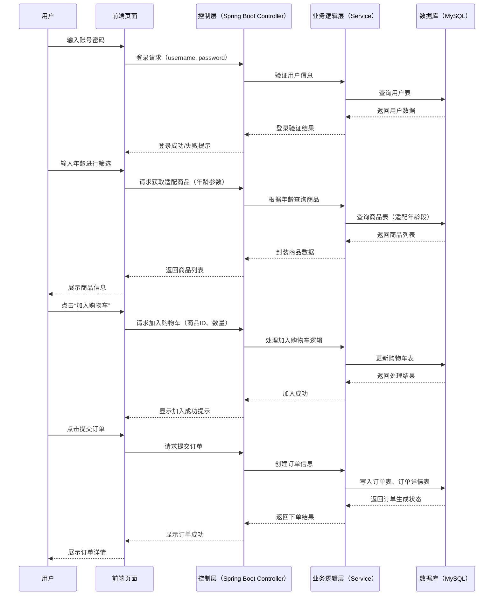

```mermaid
sequenceDiagram
    participant User as 用户
    participant FE as 前端页面
    participant Controller as 控制层（Spring Boot Controller）
    participant Service as 业务逻辑层（Service）
    participant DB as 数据库（MySQL）

    %% 登录流程
    User->>FE: 输入账号密码
    FE->>Controller: 登录请求（username, password）
    Controller->>Service: 验证用户信息
    Service->>DB: 查询用户表
    DB-->>Service: 返回用户数据
    Service-->>Controller: 登录验证结果
    Controller-->>FE: 登录成功/失败提示

    %% 年龄筛选流程
    User->>FE: 输入年龄进行筛选
    FE->>Controller: 请求获取适配商品（年龄参数）
    Controller->>Service: 根据年龄查询商品
    Service->>DB: 查询商品表（适配年龄段）
    DB-->>Service: 返回商品列表
    Service-->>Controller: 封装商品数据
    Controller-->>FE: 返回商品列表
    FE-->>User: 展示商品信息

    %% 加入购物车流程
    User->>FE: 点击“加入购物车”
    FE->>Controller: 请求加入购物车（商品ID、数量）
    Controller->>Service: 处理加入购物车逻辑
    Service->>DB: 更新购物车表
    DB-->>Service: 返回处理结果
    Service-->>Controller: 加入成功
    Controller-->>FE: 显示加入成功提示

    %% 提交订单流程
    User->>FE: 点击提交订单
    FE->>Controller: 请求提交订单
    Controller->>Service: 创建订单信息
    Service->>DB: 写入订单表、订单详情表
    DB-->>Service: 返回订单生成状态
    Service-->>Controller: 返回下单结果
    Controller-->>FE: 显示订单成功
    FE-->>User: 展示订单详情
```
